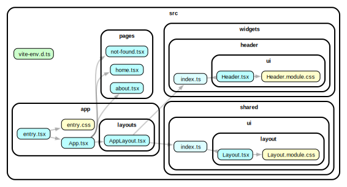

# base-app-layout

This example shows how to work with layout (or layouts). Split layout to dumb component (with markup) and smart component for widget compositions. Dumb layout can be placed in `@shared/ui/Layout`, smart - `~app/layouts/AppLayout.tsx`. See [`~app/layouts/appLayout.tsx`](./src/app/layouts/AppLayout.tsx) and [`~shared/ui/layout/*`](./src/shared/ui/layout) in code.



### Docs

Read more information on documentation (coming soon) [https://fsd-community.netlify.app/posts/base-app-layout](https://fsd-community.netlify.app/posts/base-app-layout).

### Live preview

Preview live with [StackBlitz](https://stackblitz.com/github/noveogroup-amorgunov/fsd-community/tree/main/examples/base-app-layout?file=README.md).

### How to use

Install deps and then run with npm, Yarn or pnpm to startup the example:

```bash
npm run dev
yarn dev
pnpm dev
```
