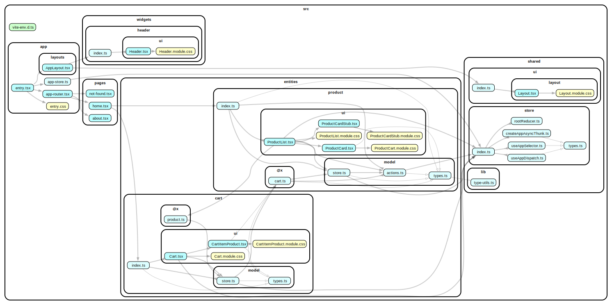

# redux

There is used some approach from FSD in this example, see reference below:

- Public API for cross-imports (@x) (see [`examples/base-entities-@x`](../examples/base-entities-@x))



### Docs

Read more information on documentation (coming soon) [https://fsd-community.netlify.app/posts/redux](https://fsd-community.netlify.app/posts/redux).

### Live preview

Preview live with [StackBlitz](https://stackblitz.com/github/noveogroup-amorgunov/fsd-community/tree/main/examples/redux?file=README.md).

### How to use

Install deps and then run with npm, Yarn or pnpm to startup the example:

```bash
npm run dev
yarn dev
pnpm dev
```
